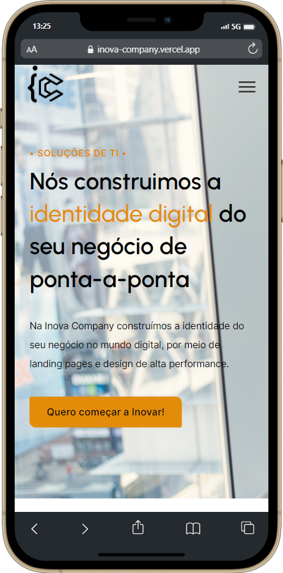
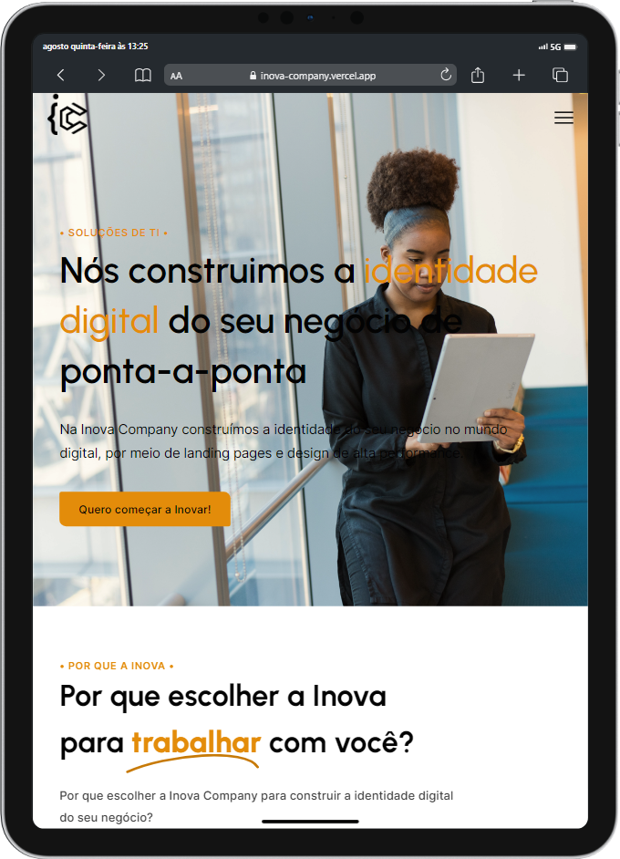

<h1 align="center">

</h1>
 

<h3 align="center">
💡 Preview - Desktop
</h3>

 
 

<h3 align="center">
💡 Preview - Mobile e Tablet
</h3>
 

&ensp; &ensp; &ensp; &ensp; &ensp; &ensp; &ensp; &ensp; &ensp; &ensp; &ensp; &ensp; &ensp; &ensp; &ensp;  &ensp; &ensp; &ensp; 
 
 

## 📈 Sobre

> É um projeto de uma landing page para a Inova Company, que é a empresa onde trabalho.
 

## 💻 Seções
O site é composto por 9 partes:

- **Home:** Nessa parte é uma breve apresentação da empresa.
- **Por que a Inova:** Mostra alguns pontos do por que escolher a Inova.
- **Serviços:** Mostra os serviços oferecidos pela empresa.
- **Portfólio:** É apresentado alguns dos projetos.
- **Equipe:** É apresentado as pessoas que fazem parte da equipe.
- **Planos:** Apresenta os planos disponíveis.
- **FAQ:** Algumas perguntas frequentes.
- **Trabalhe Conosco:** É um espaço para um candidato enviar o seu currículo para a empresa.
- **Contato:** Seção para contato com formulário,
 

---

## ⚙️ Tecnologias utilizadas:

Para o desenvolvimento deste site utilizei as seguintes tecnologias:

* HTML
* Sass
* JavaScript
* ScrollReveal
* Figma

---

## 🎐 Licença
Esse projeto está sob licença. Clique no arquivo [LICENÇA](https://github.com/larisn/larisn/blob/main/LICENSE.md) para ver mais detalhes.

 

---

Feito com 🖤 by larisn
